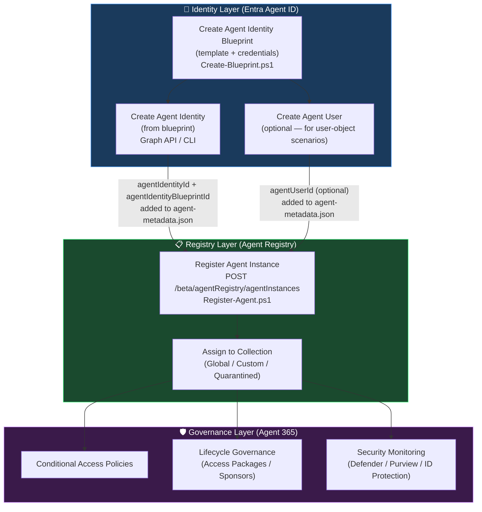
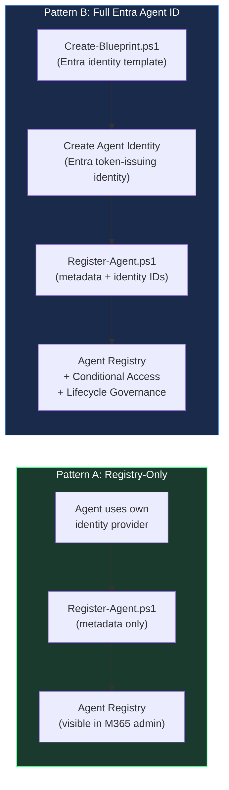

# Agent Blueprint vs. Agent Registration

This diagram clarifies the relationship between **creating an agent identity blueprint** and **registering an agent** in the Agent Registry — two distinct steps that work together to bring a code-built agent under full governance.

If you want the supporting narrative behind this diagram, start with the [Identity Blueprint Guide](./identity-blueprint/README.md). The best companion pages here are [How blueprints are used](./identity-blueprint/how-blueprints-are-used.md) and [When to use identity blueprints](./identity-blueprint/when-to-use-identity-blueprints.md).

<details>
<summary><strong>📑 Table of Contents</strong></summary>

- [Relationship Diagram](#relationship-diagram)
- [Pattern A vs. Pattern B](#pattern-a-vs-pattern-b)
- [Key Distinctions](#key-distinctions)
- [Workflow: Pattern B End-to-End](#workflow-pattern-b-end-to-end)
- [Related Documents](#related-documents)

</details>

---

## Relationship Diagram



---

## Pattern A vs. Pattern B



---

## Key Distinctions

| Concept | What It Is | Who Creates It | Script |
|---|---|---|---|
| **Agent Identity Blueprint** | Template in Entra ID that holds credentials and is the parent of all agent identities. Not visible in the Agent Registry itself. | Developer (Agent ID Developer/Admin role) | `Create-Blueprint.ps1` |
| **Agent Identity** | The actual runtime identity (no password; authenticates via token from the blueprint). | Developer (via Graph API or CLI) | Graph API / CLI |
| **Agent User** | A user-object identity for agents needing mailbox/calendar/user-context access. | Developer (via Graph API) | Graph API |
| **Agent Registry Entry** | Metadata record in the M365 admin center that makes the agent discoverable and governable. Can exist **without** a blueprint (Pattern A) or **with** one (Pattern B). | Admin / Developer (Agent Registry Admin role) | `Register-Agent.ps1` |

---

## Workflow: Pattern B End-to-End

```text
1. Create-Blueprint.ps1
   └─ Outputs: blueprintAppId

2. Create agent identity (Graph API)
   Input:  blueprintAppId
   └─ Outputs: agentIdentityId

3. Edit agent-metadata.json
   Add: agentIdentityBlueprintId = blueprintAppId
        agentIdentityId          = agentIdentityId

4. Register-Agent.ps1
   Input:  agent-metadata.json
   └─ Outputs: Agent visible in M365 admin center → Agents
```

---

## Related Documents

- [Developer Guide: Agent Identity Platform](./developer-identity-platform.md) — Step-by-step blueprint creation via Graph API
- [Enabling Code-Built Agents](./enabling-code-built-agents.md) — Pattern A and Pattern B comparison
- [Entra SDK for Agent ID](./entra-sdk-agent-id.md) — Using the blueprint's credentials for token acquisition
- [Identity Blueprint Guide](./identity-blueprint/README.md) — Definition, contents, usage patterns, and migration paths
