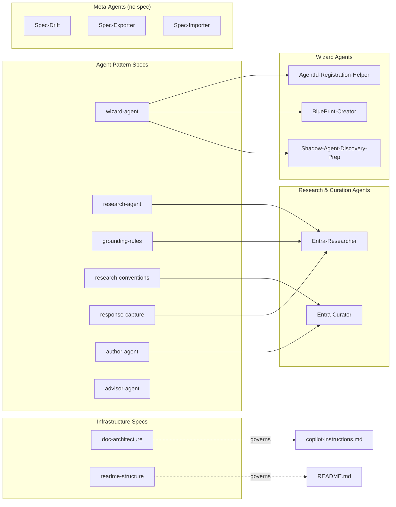

# Spec-Driven Development

> A framework for extracting, sharing, and synchronizing reusable Copilot agent patterns across repositories.

<details>
<summary><strong>📑 Table of Contents</strong></summary>

- [Spec Repository](#spec-repository)
- [How It Works](#how-it-works)
- [Agents in This Project for Spec Management](#agents-in-this-project-for-spec-management)
- [Specs Imported by This Project](#specs-imported-by-this-project)
- [Spec-to-Agent Coverage Map](#spec-to-agent-coverage-map)
  - [Agent coverage matrix](#agent-coverage-matrix)
  - [Relationship diagram](#relationship-diagram)
- [Quick Reference](#quick-reference)
- [Further Reading](#further-reading)

</details>

## Spec Repository

The canonical spec files, format reference, and full documentation live in the **arbitrated-grounding-specs** repo:

👉 **<https://github.com/paulwu/arbitrated-grounding-specs>**

This project **imports** specs from that repo. The import configuration is in [`.spec-config.yaml`](../../.spec-config.yaml) at the project root.

## How It Works

```text
┌─────────────────────────────────────────────────────────────┐
│              paulwu/arbitrated-grounding-specs│
│              (canonical spec repository)                     │
│                                                             │
│  specs/                                                     │
│  ├── grounding-rules.spec.md      Source hierarchy rules    │
│  ├── research-conventions.spec.md Frontmatter, priority     │
│  ├── response-capture.spec.md     Response file format      │
│  ├── wizard-agent.spec.md         Prerequisite/wizard flow  │
│  ├── research-agent.spec.md       Fetch/cross-ref/cite      │
│  ├── author-agent.spec.md         Note creation/validation  │
│  ├── advisor-agent.spec.md        Advisory agent pattern    │
│  ├── doc-architecture.spec.md     research→docs→scripts layers │
│  └── readme-structure.spec.md     TOC, collapsible, agents  │
│                                                             │
│  manifest.yaml                    Version, spec index       │
└──────────────┬──────────────────────────┬───────────────────┘
               │                          │
     ┌─────────▼──────────┐    ┌──────────▼──────────┐
     │ agent365-management│    │azure-resilience-adv. │
     │ (imports specs)    │    │(imports specs)        │
     └────────────────────┘    └──────────────────────┘
```

## Agents in This Project for Spec Management

These agents are included in this project to work with specs:

| Agent | Purpose |
|---|---|
| **`@spec-exporter`** | Reads this project's files and extracts patterns into spec files (writes to local `specs/` folder for review before pushing to the spec repo) |
| **`@spec-importer`** | Reads spec files from the spec repo and applies them to this project using values from `.spec-config.yaml` |
| **`@spec-drift`** | Compares this project's current state against the imported specs and reports divergences |

## Specs Imported by This Project

See [`.spec-config.yaml`](../../.spec-config.yaml) for the full list and variable values. Currently importing:

| Spec | Version | What It Governs |
|---|---|---|
| `grounding-rules` | 2.0.0 | Source hierarchy, contradiction detection, citation format |
| `research-conventions` | 2.0.0 | YAML frontmatter (`Author`, `Priority`), priority scale |
| `response-capture` | 2.0.0 | Response file naming, structure, and sources format |
| `research-agent` | 2.0.0 | Fetch live docs, cross-reference research, flag contradictions |
| `author-agent` | 2.0.0 | Create/validate knowledge notes, enforce frontmatter |
| `wizard-agent` | 1.1.0 | Prerequisite checks, `az account show` detection, autopilot warning |
| `doc-architecture` | 2.0.0 | `grounding/` → `docs/` → `scripts/` three-layer architecture |
| `readme-structure` | 1.0.0 | TOC, collapsible sections, agent table, prerequisite warnings |

## Spec-to-Agent Coverage Map

The table below shows which spec(s) govern each agent in this project.

### Agent coverage matrix

| Agent | `wizard-agent` | `research-agent` | `grounding-rules` | `research-conventions` | `response-capture` | `author-agent` | `advisor-agent` | `doc-architecture` | `readme-structure` |
|---|---|---|---|---|---|---|---|---|---|
| AgentId-Registration-Helper | ✅ | — | — | — | — | — | — | — | — |
| BluePrint-Creator | ✅ | — | — | — | — | — | — | — | — |
| Shadow-Agent-Discovery-Prep | ✅ | — | — | — | — | — | — | — | — |
| Entra-Researcher | — | ✅ | ✅ | — | ✅ | — | — | — | — |
| Entra-Curator | — | — | — | ✅ | — | ✅ | — | — | — |
| Spec-Drift | — | — | — | — | — | — | — | — | — |
| Spec-Exporter | — | — | — | — | — | — | — | — | — |
| Spec-Importer | — | — | — | — | — | — | — | — | — |

> **Infrastructure specs:** `doc-architecture` and `readme-structure` govern repository-wide conventions (folder layout, README format) rather than individual agent behaviour. They are consumed by `copilot-instructions.md` and `README.md`, not by a specific agent file.
>
> **Uncovered meta-agents:** Spec-Drift, Spec-Exporter, and Spec-Importer are the agents that *manage* the spec system itself. They ship alongside the specs rather than being generated from them.

### Relationship diagram



## Quick Reference

```bash
# Check for drift against specs
@spec-drift Compare this project against its imported specs

# Re-import specs after an update
@spec-importer Re-import specs

# Export a new pattern to specs
@spec-exporter Extract the grounding rules pattern into specs/
```

## Spec Update Lifecycle

When specs are updated in the spec repo, this project follows a four-step cycle to realize the changes:

```
┌──────────────────────────────────────────────────────────────────┐
│                     Spec Update Lifecycle                         │
│                                                                  │
│  ┌──────────┐     ┌──────────┐     ┌──────────┐     ┌─────────┐ │
│  │ 1.DETECT │────▶│ 2.REVIEW │────▶│ 3.APPLY  │────▶│4.VERIFY │ │
│  │          │     │          │     │          │     │         │ │
│  │@spec-    │     │ Read     │     │@spec-    │     │@spec-   │ │
│  │ drift    │     │ changelog│     │ importer │     │ drift   │ │
│  └──────────┘     └──────────┘     └──────────┘     └─────────┘ │
│       │                                                   │      │
│       └──────────── Clean? Done! ◄────────────────────────┘      │
└──────────────────────────────────────────────────────────────────┘
```

### What the importer handles during re-import

The `@spec-importer` detects ALL types of spec changes when it finds an existing `.spec-config.yaml`:

| Change Type | Detection | Resolution |
|---|---|---|
| New variable | Missing from config | Prompts for value |
| Changed variable metadata | Description/default differs | Informational notice |
| Removed variable | In config but not in spec | Offers to clean up |
| New dependency | Spec added a `requires` | Auto-adds or prompts |
| New/changed sections | Template content differs | Shows diff, asks to accept |
| New artifact | Referenced file doesn't exist | Offers to scaffold placeholder |
| Version bump | Config version < manifest | Updates config after re-import |

For the full details on each change type, see the [FAQ — Applying Spec Updates](./faq.md#applying-spec-updates-to-your-project).

## Further Reading

- [Spec repository — full documentation](https://github.com/paulwu/arbitrated-grounding-specs)
- [`.spec-config.yaml`](../../.spec-config.yaml) — this project's import configuration
- [GitHub Copilot Primer](../github-copilot-primer/README.md) — how the agents in this project work
